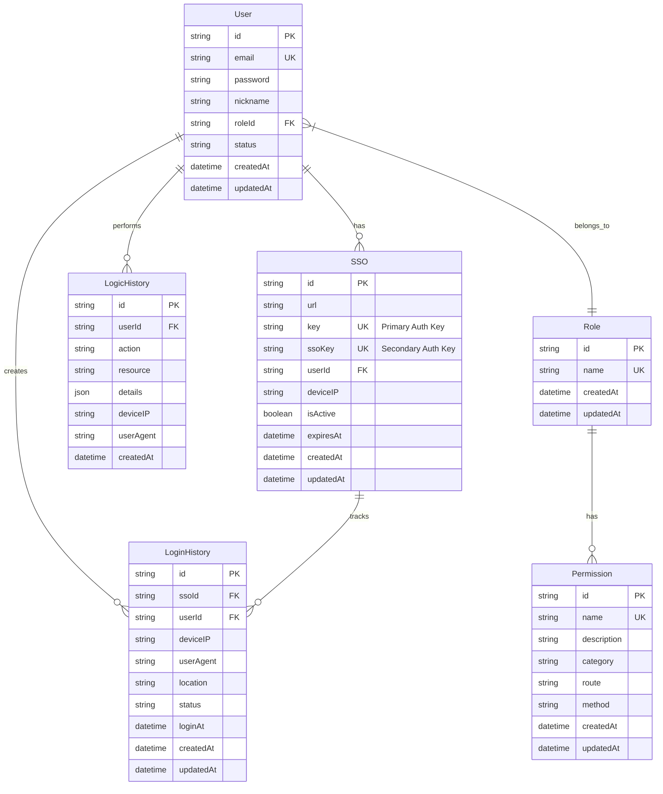
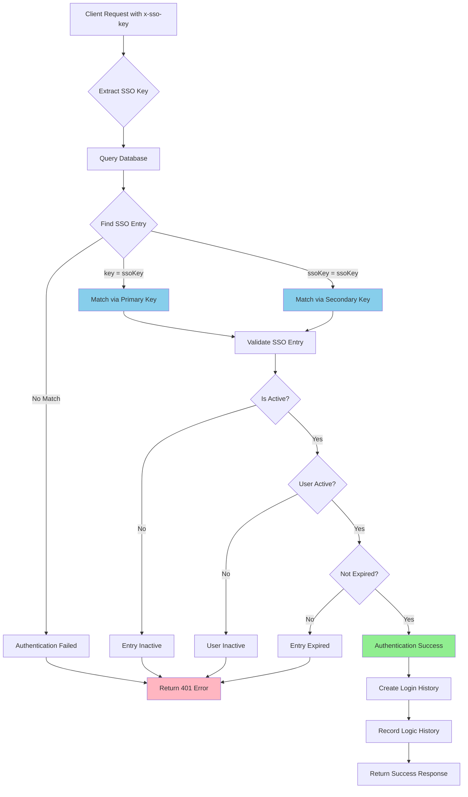
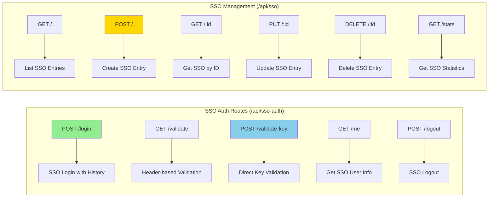
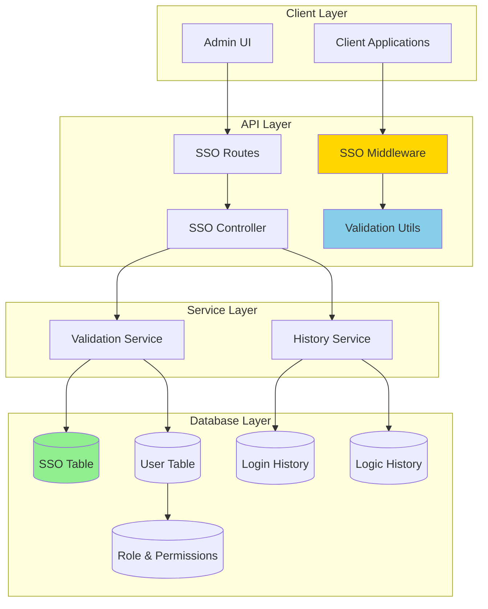
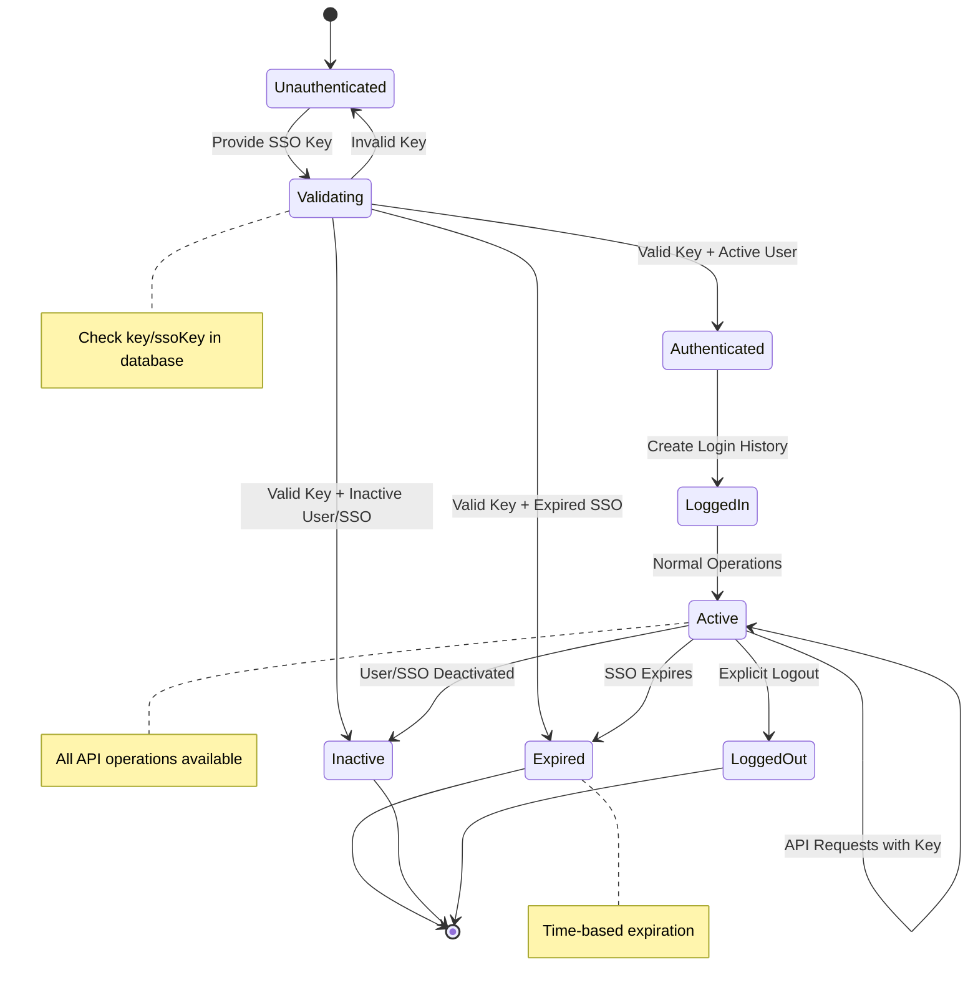

# SSO Login Schema & Architecture

## 🏗️ **Database Schema**

### **Entity Relationship Diagram**



## 🔄 **SSO Authentication Flow**

### **Complete SSO Login Process**

```mermaid
sequenceDiagram
    participant Client as Client Application
    participant API as Auth API
    participant DB as Database
    participant History as History Service

    Note over Client, History: SSO Authentication Flow

    Client->>API: POST /api/sso-auth/login
    Note right of Client: Headers: x-sso-key: {ssoKey}
    Note right of Client: Body: {deviceIP, userAgent, location}

    API->>API: Extract x-sso-key header

    alt SSO Key Validation
        API->>DB: SELECT * FROM sso WHERE key = {ssoKey} OR ssoKey = {ssoKey}
        DB-->>API: SSO Entry + User Data

        API->>API: Validate SSO Entry
        Note right of API: Check: isActive, user.status, expiresAt

        alt Validation Success
            API->>DB: INSERT INTO loginHistory
            DB-->>API: Login History Created

            API->>History: Record SSO Login Action
            History->>DB: INSERT INTO logicHistory
            DB-->>History: Logic History Created

            API-->>Client: Success Response
            Note left of API: {loginHistory, user, sso}
        else Validation Failed
            API-->>Client: 401 Unauthorized
            Note left of API: {error: "Invalid/Expired SSO"}
        end
    else No SSO Key
        API-->>Client: 401 Unauthorized
        Note left API: {error: "SSO authentication required"}
    end
```

## 🔐 **SSO Key Validation Schema**

### **Dual Key Authentication System**



## 🛠️ **API Endpoints Schema**

### **SSO Authentication Endpoints**



## 📊 **Data Flow Architecture**

### **SSO System Components**



## 🔑 **SSO Key Types & Usage**

### **Key Structure and Validation**

```mermaid
classDiagram
    class SSOEntry {
        +string id
        +string url
        +string key (Primary)
        +string ssoKey (Secondary)
        +string userId
        +string deviceIP
        +boolean isActive
        +DateTime expiresAt
        +validateKey(inputKey) boolean
        +isExpired() boolean
        +getUserPermissions() Permission[]
    }

    class PrimaryKey {
        +string value (64 chars)
        +generated crypto.randomBytes(32).toString('hex')
        +unique true
        +required true
    }

    class SecondaryKey {
        +string value (16+ chars)
        +generated from URL domain or random
        +unique true
        +required false
    }

    class User {
        +string id
        +string email
        +string status
        +Role role
        +Permission[] permissions
    }

    SSOEntry ||--|| PrimaryKey : has
    SSOEntry ||--o| SecondaryKey : has
    SSOEntry ||--|| User : belongs_to

    note for SSOEntry "Both key and ssoKey can be used for authentication"
    note for SecondaryKey "Optional custom key for easier identification"
```

## 🔄 **State Machine for SSO Session**

### **SSO Authentication States**



## 📋 **Request/Response Schema**

### **SSO Login Request**

```json
{
  "endpoint": "POST /api/sso-auth/login",
  "headers": {
    "x-sso-key": "string (required)",
    "content-type": "application/json"
  },
  "body": {
    "deviceIP": "string (optional)",
    "userAgent": "string (optional)",
    "location": "string (optional)"
  }
}
```

### **SSO Login Response**

```json
{
  "success": true,
  "data": {
    "loginHistory": {
      "id": "uuid",
      "ssoId": "uuid",
      "userId": "uuid",
      "deviceIP": "192.168.1.100",
      "userAgent": "Mozilla/5.0...",
      "location": "New York, US",
      "status": "active",
      "loginAt": "2025-10-15T10:30:00Z"
    },
    "user": {
      "id": "uuid",
      "email": "user@example.com",
      "nickname": "John Doe",
      "roleId": "uuid",
      "permissions": ["read", "write"]
    },
    "sso": {
      "id": "uuid",
      "url": "https://app.example.com",
      "isActive": true,
      "expiresAt": "2025-12-31T23:59:59Z"
    }
  }
}
```

### **Key Validation Schema**

```json
{
  "endpoint": "POST /api/sso-auth/validate-key",
  "body": {
    "ssoKey": "string (required)"
  },
  "response": {
    "valid": "boolean",
    "matchedKeyType": "key | ssoKey",
    "sso": {
      "id": "uuid",
      "url": "string",
      "userId": "uuid",
      "isActive": "boolean",
      "expiresAt": "datetime | null"
    },
    "user": {
      "id": "uuid",
      "email": "string",
      "nickname": "string"
    },
    "error": "string (if invalid)"
  }
}
```

## 🏢 **System Architecture Overview**

### **Complete SSO Ecosystem**

```mermaid
architecture-beta
    group api(logos:fastapi)[Auth API]

    service db(logos:mysql)[MySQL Database] in api
    service redis(logos:redis)[Redis Cache] in api
    service prisma(logos:prisma)[Prisma ORM] in api

    group auth(logos:auth0)[Authentication Layer]
    service sso(logos:oauth)[SSO Service] in auth
    service jwt(logos:jwt)[JWT Service] in auth
    service rbac(logos:shield)[RBAC Service] in auth

    group ui(logos:react)[Frontend]
    service admin(logos:react)[Admin Panel] in ui
    service client(logos:javascript)[Client Apps] in ui

    group external[External Systems]
    service app1(logos:chrome)[App 1] in external
    service app2(logos:firefox)[App 2] in external
    service app3(logos:safari)[App 3] in external

    admin:R --> L:sso
    client:R --> L:sso
    app1:R --> L:sso
    app2:R --> L:sso
    app3:R --> L:sso

    sso:R --> L:prisma
    jwt:R --> L:prisma
    rbac:R --> L:prisma

    prisma:R --> L:db
    sso:R --> L:redis
```



This comprehensive schema shows the complete SSO login system architecture, data flows, and all the validation processes involved in the authentication system! 🎉
